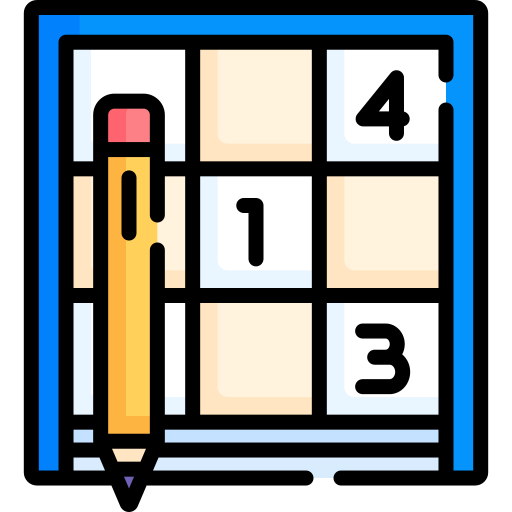

# Sudoku Game
[](https://github.com/OV111/Sudoku_Game/stargazers)
[](https://choosealicense.com/licenses/mit/)

<!-- PROJECT LOGO -->
<br />
<div align="center">
  <a href="https://github.com/OV111/Sudoku_Game">
    
  </a>  
</div>

<!-- TABLE OF CONTENTS -->
<details>
  <summary>Table of Contents</summary>
  <ol>
    <li>
      <a href="#about-the-project">About The Project</a>
      <ul>
        <li><a href="#built-with">Built With</a></li>
        <li><a href="#installation">Installation</a></li>
      </ul>
    </li>
    <li><a href="#license">License</a></li>
    <li><a href="#contact">Contact</a></li>
    <li><a href="#motivation">Motivation for Creating!</a></li>
  </ol>
</details>

<!-- About Section -->
## About The Project
A simple and interactive Sudoku Game built using JavaScript. This project allows users to solve a Sudoku puzzle, providing a clean, user-friendly interface to play and test their puzzle-solving skills. The game includes features like automatic validation and highlights for correct or incorrect inputs.

<!-- Tech used! -->
### Built With
 The game logic, including puzzle generation, validation, and user interaction, is powered by JavaScript (including 2 js files).

* [JavaScript](https://img.shields.io/badge/JavaScript-323330?style=for-the-badge&logo=javascript&logoColor=F7DF1E)

* [HTML](https://img.shields.io/badge/HTML5-E34F26?style=for-the-badge&logo=html5&logoColor=white)

* [CSS](https://img.shields.io/badge/CSS3-1572B6?style=for-the-badge&logo=css3&logoColor=white)

<p align="right">(<a href="#readme-top">back to top</a>)</p>

<!-- Installation -->
### Installation

1. Clone this repository:
   ```sh
   git clone https://github.com/OV111/Sudoku_Game.git
   ```
2. Navigate to the project folder: Change to the project directory:
    ```sh
    cd Sudoku_Game
    ```

<!-- LICENSE -->
### License

For more information, see the `LICENSE.txt` file.

### Contact Info

[](https://mail.google.com/mail/u/0/#inbox)

[](https://www.linkedin.com/in/vahe-ohanyan-352165328/)

### Motivation for Creating!

I was first drawn to the logic behind Sudoku, appreciating how the puzzle’s structure allows for a deep, systematic approach. As I explored further, I discovered the backtracking algorithm and found it fascinating. This led me to continuously research ways to implement it effectively, and the idea of building my own version of a Sudoku game became a natural next step. The challenge of applying the backtracking algorithm to create a functional game, while also improving my coding skills, was incredibly motivating and rewarding. Additionally, I’ve been greatly inspired by Kenny Yip's coding, which motivated me to take on this project!!!